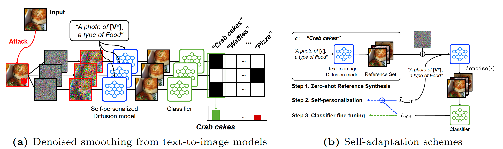

# [ECCV 2024 - Oral] Adversarial Robustification via Text-to-Image Diffusion Models
This repository contains code for the paper [Adversarial Robustification via Text-to-Image Diffusion Models](https://arxiv.org/html/2407.18658v1) by [Daewon Choi*](), [Jongheon Jeong*](https://jh-jeong.github.io/), [Huiwon Jang](https://huiwon-jang.github.io/) and [Jinwoo Shin](https://alinlab.kaist.ac.kr/shin.html).
(*Equally Contributed)

In this paper, by leveraging text-to-image diffusion models, we provide a scalable framework that does not require any external datasets in robustifiying image classifiers. We successfully incoporate text-to-image diffusion models into denoisy-classify pipeline as adaptable framework that can be self-optimized to specific tasks.




## 📣 News
- [2024.08.17] Code is uploaded. 
- [2024.08.12] Our paper is accepted for **Oral presentation** in **ECCV 2024** 🎉.
- [2024.07.01] Our paper is accepted by **ECCV 2024** 🎉.
 
## 💻 Get Started
### Set Environments
This repository already contain [diffusers 0.20.0](https://github.com/huggingface/diffusers) files.
So, you don't need to install diffusers. 
Just track below environment setting.
```
# git clone this repository
git clone https://github.com/ChoiDae1/robustify-T2I.git
cd robustifiy-T2I

# make conda virtual environment for python version
conda create -n certified python=3.10.12 
conda activate certified

# make python virtual environment 
python -m venv .venv 
source .venv/bin/activate
conda deactivate

# download necessary libraries
pip install -r requirements.txt 
```
You should **replace** files in .venv/lib/python3.10.12/site-packages/torchvision/datasets with the files in replace folder in this repo. 

### Self-Adaptation 
In this phase, we first synthesize a few reference images via text-to-image diffusion models and then, fine-tune text-to-image diffusion models and classifiers with them. Other adaptation details (ex. hyper-parameters) is reported in Appendix in our paper. By executing below code sequentially, you finally obtain checkpoints. 
```
# synthesize a few reference images
sh scripts/synthesize_set.sh

# self-personalization 
sh scripts/self_personalization.sh 

# classifier fine-tuning 
sh scripts/classifier_finetuning.sh
```


### Evaluation 
For evaluation, we provide two type of codes, one is for testing empirical accuracy and other is for certified accuracy. After code execution, output file is saved at path ```--output_dir```. Other evaluation details (ex. attack/smoothing parameters) is reported in Appendix in our paper.

```
# for empirical accuracy
sh scripts/eval_empirical.sh

# for certified accuracy 
sh scripts/eval_certified.sh
```
After obtaining the output file, you can visualize/calculate accuracy by using jupyter file ```analysis/analyze.py```. We provide some examples in ```analyze_example.ipynb```.
When computing empirical **clean** accuracy, you directly execute ```measure_empirical_clean.py``` by using output file and classifier checkpoint. 

## 📝 Citation

```bibtex
@inproceedings{RobustifyT2I,
  title={Adversarial Robustification via Text-to-Image Diffusion Model},
  author={Daewon Choi and Jongheon Jeong and Huiwon Jang and Jinwoo Shin},
  booktitle={European Conference on Computer Vision},
  year={2024}
}
```
 
 ### Acknowledgment
 This project is based on [randomzied smoothing](https://github.com/locuslab/smoothing). We also thank [diffusers](https://github.com/huggingface/diffusers), [clip](https://github.com/openai/CLIP) for the pretrained models, [TeCoA](https://github.com/cvlab-columbia/ZSRobust4FoundationModel) for dataset settings.  
